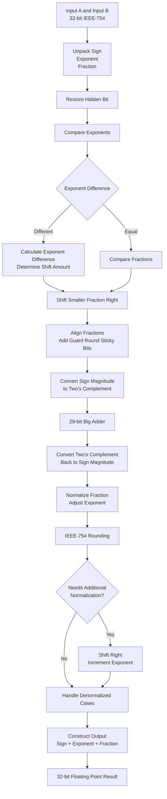
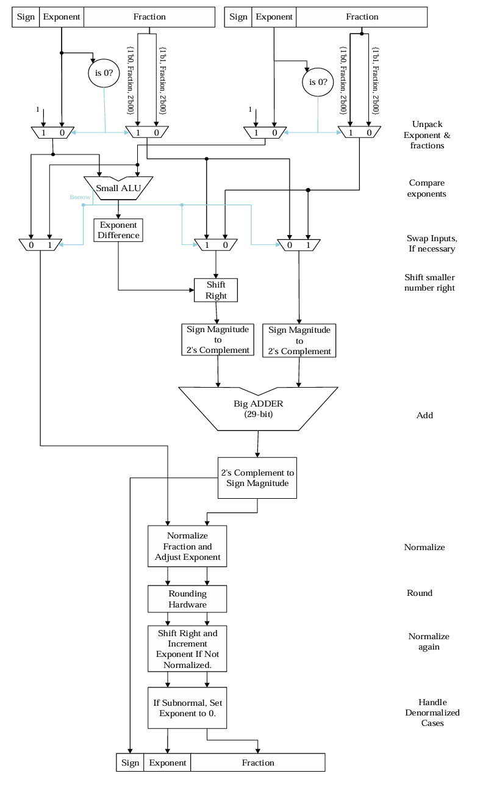

# IEEE-754 Floating Point Adder (Single Precision)

## Overview

This project implements a **32-bit IEEE-754 single precision floating-point adder** using Verilog.

The goal of this project was to design a combinational hardware circuit capable of adding two floating-point numbers while following the IEEE-754 standard representation.

The implemented module receives two 32-bit floating-point inputs and generates a 32-bit floating-point result.

The design supports:

- Normalized floating-point numbers
- Denormalized floating-point numbers
- Positive and negative operands
- Floating-point alignment, addition, normalization, and rounding

The implementation was developed and verified using Verilog simulation.

---

# IEEE-754 Single Precision Representation

A single precision floating-point number consists of:

| Field | Width |
|---|---:|
| Sign | 1 bit |
| Exponent | 8 bits |
| Fraction | 23 bits |

```
31                         23 22                         0
+----------------------------+----------------------------+
| Sign (1 bit) | Exponent   |        Fraction             |
|              |  (8 bits)  |        (23 bits)            |
+----------------------------+----------------------------+
```

The hidden bit is restored internally depending on whether the input number is normalized or denormalized.

---

# Project Structure

```
.
├── fp_adder.v
├── fp_adder_tb.v
├── fp_adder_tb2.sv
├── fp_adder_tb3.sv
├── fp.hex
├── docs/
│   └── fp_adder_architecture.png
└── README.md
```

---

# Main Hardware Module

The main design module is:

```verilog
module fp_adder(
    input  [31:0] a,
    input  [31:0] b,
    output [31:0] s
);
```

## Inputs

| Signal | Description |
|---|---|
| `a` | First IEEE-754 single precision operand |
| `b` | Second IEEE-754 single precision operand |

## Output

| Signal | Description |
|---|---|
| `s` | IEEE-754 floating-point addition result |

---

# Floating Point Addition Algorithm

The floating-point addition hardware follows these main stages:

1. **Unpack Inputs**
   - Extract sign, exponent, and fraction fields.
   - Restore the hidden bit when required.

2. **Exponent Comparison**
   - Compare the two exponent values.
   - Determine the larger and smaller operand.

3. **Fraction Alignment**
   - Calculate exponent difference.
   - Shift the smaller fraction to align both operands.

4. **Signed Addition**
   - Convert sign-magnitude representation into two's complement.
   - Perform signed addition using the main adder.

5. **Result Conversion**
   - Convert the result back into sign-magnitude representation.

6. **Normalization**
   - Adjust fraction position.
   - Update exponent accordingly.

7. **Rounding**
   - Apply IEEE-754 rounding using guard, round, and sticky bits.

8. **Final Reconstruction**
   - Combine sign, exponent, and fraction fields into the final 32-bit result.

---

# Hardware Architecture Flow

The following diagram shows the implemented floating-point addition datapath.



---

# Reference Hardware Diagram

The following image is the original floating-point addition architecture from the laboratory-guide specification.

It shows the hardware blocks involved in:

- Exponent comparison
- Operand alignment
- Shift operation
- Sign conversion
- Main addition
- Normalization
- Rounding




---

# Verification

The design was tested using ModelSim simulation with multiple floating-point test vectors.

Examples:

```
32'h440d491c + 32'h4d064db7 = 32'h4d064dda

32'h3F800001 + 32'hBF800001 = 32'h00000000

32'h40000000 + 32'h34000000 = 32'h40000000
```

The tests include:

- Addition of positive numbers
- Addition of negative numbers
- Different exponent values
- Fraction alignment cases
- Cancellation cases
- Normalized numbers
- Denormalized numbers

---

# Simulation Files

## fp_adder_tb.v

Main simulation testbench.

## fp_adder_tb2.sv

Additional verification environment.

## fp_adder_tb3.sv

Additional verification environment.

## fp.hex

Hexadecimal test data used for simulation.

---

# Tools Used

- Verilog HDL
- SystemVerilog
- ModelSim
- Visual Studio Code
- Git / GitHub

---

# Concepts Demonstrated

This project demonstrates:

- IEEE-754 floating-point representation
- Hardware arithmetic design
- Combinational circuit design
- Exponent alignment
- Signed arithmetic conversion
- Floating-point normalization
- IEEE rounding logic
- HDL simulation and verification

---

# Author
Dr.Movahedin computer structure course,

Arshia Noroozi (4rsh1y4)
